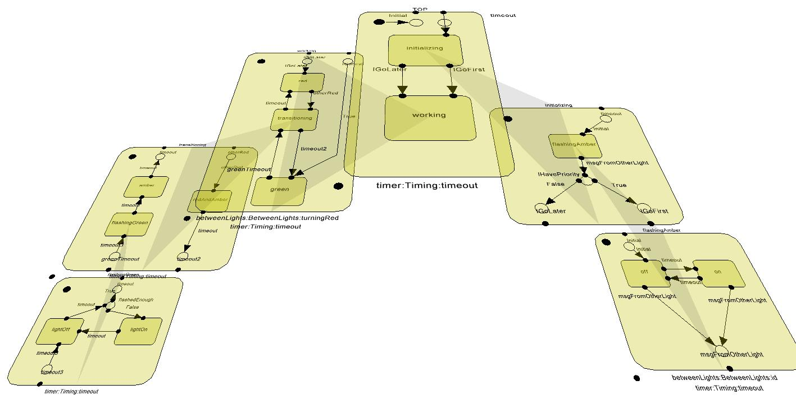
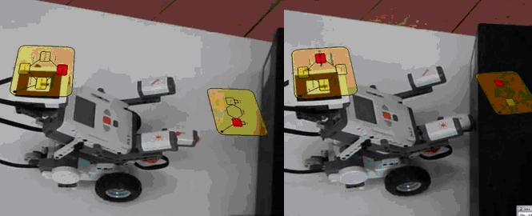

Diorama
=======
Diorama is a AR/VR platform for human centered systems modelling. The project modernises AR/VR technology for current platforms work derived from a 2009 PhD in applying 3D visualisation to software engineering - **X3D-UML: User-Centred Design, Implementation and Evaluation of 3D UML Using X3D** [http://researchbank.rmit.edu.au/eserv/rmit:6740/Mcintosh.pdf] - Paul McIntosh 
 

# Overview

Diorama turns computer game technology on its head and uses the power of computers to let the computer teach us about itself, through visualisation and interaction of actual systems in real-time.

Diorama is an education and research tool enabling users to see and interact with computer software using a 3D AR/VR environments. Diorama extends existing PhD research into the useability of 3D technology for interacting with computer systems. Converting the already existing OpenSceneGraph cross-platform x3d-uml software into current state of the art AR/VR technology Diorama will create a powerful evidence based education tool, by incorporating a game aspect into the tool. With this we also create a powerful research tool to improve human centred systems engineering by being able to capture measurable improvements between visualisation and interaction techniques. A high-score in this game equals an educated child/student/engineer and seminal research into the area of 3D useability.

# Background

Consider the movies “Tron”, “Hackers”, “Swordfish”, “Minority Report” or in fact any other movie that portrays a computer expert interacting with a computer (past, present or future). Each movie presents the public with an image of fantastic user interfaces, with rich graphics that aid the viewer to easily understand the plot.

The reality for learning and interacting with computer software though could not be further from this, with most interaction with computers involving the same (boring) way, using text, as has been used for decades. And unlike movies it doesn’t take seconds for anyone to learn the “plot”, it takes years of higher education to learn enough about computers to be able to interact with them, this is because we are dealing with what can’t be seen. 

The X3D-UML research bought those movie interfaces closer to reality and this is to be developed further to a tool called Diorama. Diorama is based on open source technology to allow people to see what is going on and understand how the computer “thinks”. The Diorama project will make learning about the computer and how it does its “thing” easier and fun. With the game aspect we aim to allow Diorama to:

* Teach reading age children the basics of computer programming
* Teach University students advanced software engineering topics
* Teach Software Engineers to work with software in a new way

In addition to this, the reason that computer interfaces for learning and interacting with computer software do not use game technology is that the area is largely unexplored and untested. It is easier to keep the status quo than invest time and effort in unknown technology. By using the game aspect we want to be able to use a “high score” to evaluate the effectiveness of different user interaction techniques. Not only would Diorama help educate others, Diorama would educate ourselves by gaining research results unachievable in any other context and advance the science behind human computer interaction in AR/VR environments.

# X3D-UML examples

Some original examples to be ported to Diorama.
3D UML State Machine Diagrams have been evaluated against actual user tasks and data, providing quantative evidence for the need of cross diagram visualisation [X3D-UML 2008]. 3D UML Mechatronic Diagrams for real-time debugging of robot behaviour through augmented reality, showing the benefit of combined views of software and hardware interacting insitu [X3D-UML 2010].

*Interacrive VR visualisation of simple software system* [X3D-UML 2008]

*Realtime AR visualisation of robot code* [X3D-UML 2010]

[X3D-UML 2008]: X3D-UML: 3D UML State Machine Diagrams.* MCINTOSH, P., HAMILTON, M. & SCHYNDEL, R.  Proceedings of the 11th international conference on Model Driven Engineering Languages and Systems. Toulouse, France, Springer-Verlag (MODELS 2008) [https://www.researchgate.net/publication/221223850_X3D-UML_3D_UML_State_Machine_Diagrams]

[X3D-UML 2010]: X3D-UML: 3D UML Mechatronic Diagrams. MCINTOSH, P & HAMILTON, M. Australian Software Engineering Conference. Auckland, New Zealand(ASWEC 2010) [https://www.computer.org/csdl/proceedings/aswec/2010/4006/00/4006a085-abs.html]